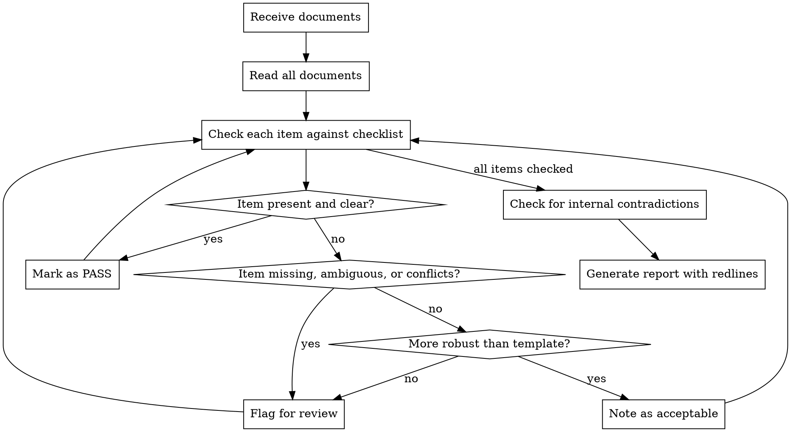

# Ohio Therapy Policy Review

## Overview

Review therapy practice policies for Ohio compliance by comparing submitted documents against reference templates and Ohio legal requirements. Flag missing items, conflicts, ambiguous language, and internal contradictions.

**Key principle:** Content matters, not document structure. Required provisions may appear in non-standard locations. Review documents as a package.

## Reference Templates Location

```
ohio-therapy-policy-review/reference-templates/
```

**Required documents to check for:**
1. Informed Consent (general)
2. Informed Consent for Couples Therapy
3. Minor Client Consent and Parental Agreement
4. Fee Structure/Agreement
5. Privacy Policies (HIPAA Notice of Privacy Practices)
6. No Surprises Act Notice / Good Faith Estimate
7. AI Consent (if practice uses AI tools)

## Review Process



## Review Checklist

### 1. Professional Disclosure Statement (ORC 4757.12)

| Item | Check For |
|------|-----------|
| License type | Clearly stated (LSW, LISW, LPC, LPCC, LMFT, etc.) |
| License number | Present and complete |
| Areas of competence | Listed |
| Formal education | Degrees, institution, year |
| Board disclosure footer | "This information is required by the counselor, social worker, and marriage and family therapist board..." |
| Board contact info | Ohio CSWMFT Board, 77 S. High St 24th Fl, Columbus OH 43215, 614-466-0912 |

### 2. Informed Consent - General (OAC 4757-5-02)

| Item | Check For |
|------|-----------|
| Nature of therapy | Description of therapeutic process |
| Risks and benefits | Disclosed |
| Confidentiality | Explained with limits |
| Right to refuse/withdraw | Client autonomy stated |
| Questions encouraged | Client can ask about methods, training |
| Complaint process | Ohio Board portal link and/or contact |

### 3. Confidentiality Limits - Ohio Specific

| Item | Check For | Ohio Citation |
|------|-----------|---------------|
| Suicide/self-harm | Disclosure when substantial risk | OAC 4757-5-02 |
| Duty to warn | **Ohio standard:** explicit threat + imminent serious physical harm + clearly identifiable victim(s) + intent and ability | ORC 2305.51 |
| Child abuse/neglect | Mandatory reporting disclosed | ORC 2151.421 |
| Elder abuse/neglect | Mandatory reporting disclosed (expanded Jan 2025) | ORC 5101.61 |
| Vulnerable adult abuse | Mandatory reporting disclosed | ORC 5101.61 |
| Companion animal abuse | Mandatory reporting disclosed | OAC 4757-5-10 |
| Court orders/subpoenas | Disclosure requirement explained | ORC 2317.02 |
| Insurance audits | May require disclosure | HIPAA |

### 4. Minor Client Consent (ORC 5122.04)

| Item | Check For |
|------|-----------|
| Ohio 14+ consent law | Minors 14+ may consent to 6 sessions or 30 days without parental consent |
| Substantial harm standard | Parents notified only if substantial probability of harm |
| Identified client | Child is the client, not parent |
| Custody documentation | Required before treatment |
| Confidentiality with minors | Age-appropriate privacy explained |
| Parent access limits | Parent agrees to respect therapeutic confidentiality |
| Custody/testimony policy | Practice does not do custody evaluations |

### 5. Couples/Family Therapy Consent (OAC 4757-5-02)

| Item | Check For |
|------|-----------|
| Confidentiality agreement | Sought among all parties |
| No secrets policy | Clearly stated (or alternative policy) |
| Cannot guarantee compliance | Noted that therapist cannot ensure all parties honor agreements |
| Individual sessions | How handled within couples work |
| Court proceedings | Agreement not to subpoena therapist/records |
| Records release | Requires consent of all parties |
| Contraindications | When couples therapy is not appropriate |

### 6. Fee Structure (ORC 4757.12)

| Item | Check For |
|------|-----------|
| Fee schedule | Listed by service type |
| Cancellation policy | Timeframe and fee |
| No-show policy | Fee amount |
| Payment methods | Accepted forms |
| Card on file | Policy explained |
| Insurance billing | How handled, superbill availability |
| Good Faith Estimate | Referenced or provided |
| No Surprises Act | Notice provided or referenced |

### 7. Telehealth (OAC 4757-5-13)

| Item | Check For |
|------|-----------|
| Ohio telehealth law compliance | Referenced |
| State licensure limits | Services only when client in state where therapist licensed |
| Local crisis hotline | Phone number provided |
| Local emergency MH services | Phone number provided |
| Technology contingency plan | What happens if connection fails |
| Location confirmation | Client confirms location at start of session |
| Privacy expectations | Client's environment should be private |
| Provider restrictions | Cannot practice while operating motor vehicle |
| Platform security | HIPAA-compliant platform disclosed |

### 8. Privacy Policies / HIPAA Notice

| Item | Check For |
|------|-----------|
| Notice of Privacy Practices | Complete HIPAA notice |
| PHI use and disclosure | Treatment, payment, operations explained |
| Psychotherapy notes | Special protections explained |
| Patient rights | Access, amendment, accounting, restrictions |
| Record retention | 7 years per OAC 4757-5-09 |
| Complaint process | HHS OCR and Ohio Board |

### 9. AI/Technology Consent (if applicable)

| Item | Check For |
|------|-----------|
| AI tools used | Listed (note-taking, scheduling, billing, etc.) |
| AI tools NOT used for | Clinical decisions, direct communication, emotion detection |
| Session transcription | Separate opt-in if recording/transcribing |
| Data handling | How AI-processed data is stored/deleted |
| HIPAA compliance | AI vendor is HIPAA compliant |
| Right to revoke | Can withdraw AI consent without affecting care |

### 10. Additional Ohio Requirements

| Item | Check For | When Required |
|------|-----------|---------------|
| Supervision disclosure | Supervisor name, that therapist is supervised | If therapist is under supervision (OAC 4757-23-01) |
| Involuntary client notice | Nature of services, right to refuse, consequences | Court-mandated clients (OAC 4757-5-02) |
| Unproven techniques | Disclosed as "unproven" or "developing" with risks | If using non-empirical modalities (OAC 4757-5-02) |
| Records custodian | Plan exists for incapacitation/death | Best practice (OAC 4757-5-09) |

### 11. Internal Consistency

| Check For |
|-----------|
| No contradictions between documents |
| Consistent fee amounts across documents |
| Consistent confidentiality limits across documents |
| Consistent cancellation policies across documents |
| Contact information matches across documents |

## Output Format

Generate a report with:

### 1. Summary (top of report)
```markdown
# Ohio Therapy Policy Review Report

**Practice:** [Name]
**Date:** [Date]
**Reviewer:** [Name]

## Summary
- **Documents Reviewed:** [count]
- **Items Checked:** [count]
- **Items Passed:** [count]
- **Items Needing Attention:** [count]

## Priority Findings
[List top issues here]
```

### 2. Detailed Findings

For each item needing attention:
```markdown
### [Item Name]

**Status:** Missing / Ambiguous / Conflicts with template / Internal contradiction

**Location:** [Document name], Page [X], Section "[Section name]"

**Current Language:**
> [Quote from document if applicable]

**Issue:**
[Describe the problem]

**Suggested Language:**
> [Reference template language or recommended fix]
```

### 3. Redline Output Files

Generate separate files for easy client acceptance:
- `redlines.md` - Markdown format with all suggested changes
- Optionally convert to Word format if tools available

Use this structure for redline suggestions:
```markdown
# Suggested Revisions

## [Document Name]

### Section: [Section Name]

**Current:**
> [existing text]

**Suggested:**
> [new text with changes]

**Reason:** [Brief explanation referencing Ohio requirement]
```

## Quick Reference - Ohio Citations

| Topic | Citation |
|-------|----------|
| Professional disclosure | ORC 4757.12 |
| Ethical standards | OAC 4757-5-02 |
| Record keeping | OAC 4757-5-09 |
| Mandatory reporting | OAC 4757-5-10 |
| Telehealth | OAC 4757-5-13 |
| Supervision | OAC 4757-23-01 |
| Minor consent | ORC 5122.04 |
| Duty to protect | ORC 2305.51, OAC 5122-3-12 |
| Child abuse reporting | ORC 2151.421 |
| Elder abuse reporting | ORC 5101.61 |
| Privileged communications | ORC 2317.02 |

## Common Issues

| Issue | What to Flag |
|-------|-------------|
| Generic duty to warn | Ohio requires explicit threat + identifiable victim |
| Missing companion animal | Often forgotten in mandatory reporting list |
| Incomplete Board info | Need full address and phone, not just website |
| Missing license number | Must be in professional disclosure |
| Telehealth too brief | Ohio requires crisis numbers and contingency plan |
| No AI consent | Required if practice uses any AI tools |

## Notes

- **More robust than template is acceptable** - only flag if contradictions exist
- **Do not assign severity** - reviewing attorney determines priority
- **All findings must be addressed** before returning to client
- **Content over location** - required items may be in non-standard places
